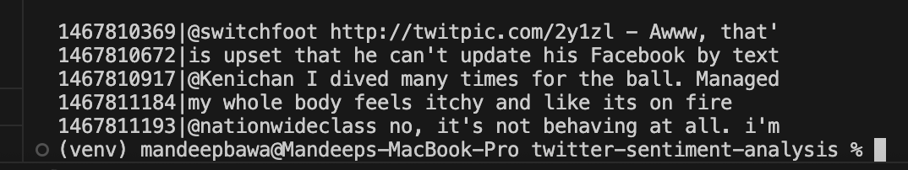
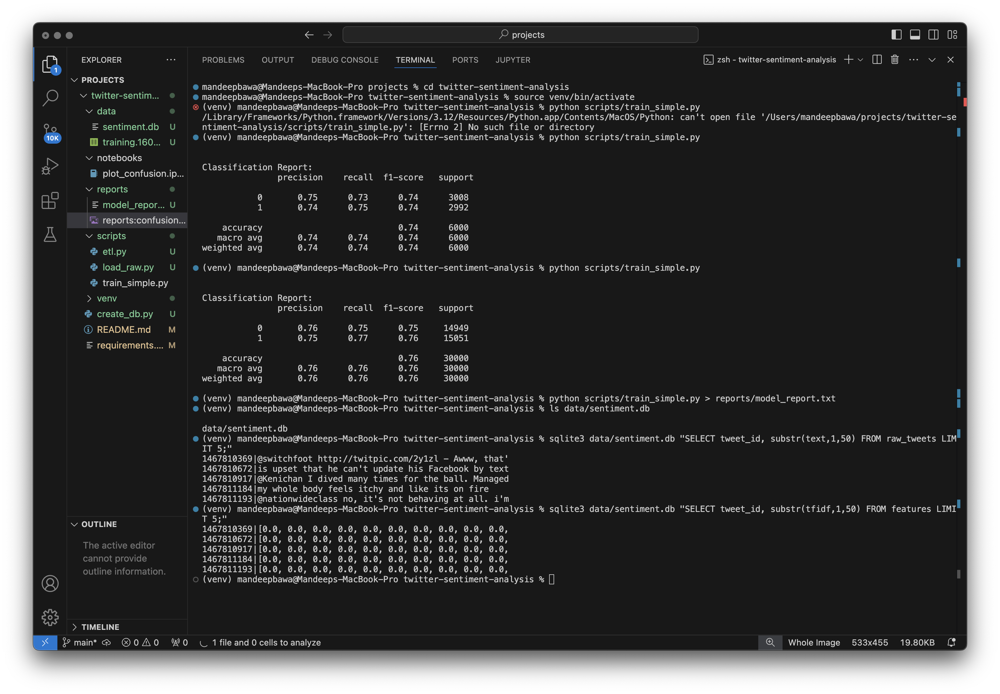
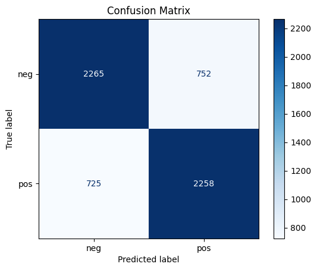

# Twitter Sentiment Analysis Final Report

**Author:** mandeep0004  
**GitHub:** https://github.com/mandeep0004/twitter-sentiment-analysis  
**Date:** July 14, 2025

---

## 1. Introduction & Problem Definition

Social media platforms like Twitter provide real-time insights into public sentiment, which can benefit businesses, researchers, and policymakers. This project builds a lightweight pipeline to ingest and store labeled tweets, transform text data, and apply a machine-learning classifier to predict tweet sentiment (positive vs. negative). Through this, we demonstrate core topics from CS210: database schema design, ETL workflows, and predictive modeling.

## 2. Data & Database Schema

- **Dataset:** Sentiment140 (1.6 million tweets labeled positive/negative).  
- **Storage:** SQLite database file `data/sentiment.db` with two tables:
  - `raw_tweets(tweet_id TEXT PRIMARY KEY, label INTEGER, text TEXT)`  
  - `features(tweet_id TEXT PRIMARY KEY, tfidf TEXT)` (JSON-encoded TF-IDF vectors)

### Sample Raw vs. Cleaned Text



### Class



_Above: Five sample raw tweets (first 50 chars) loaded into `raw_tweets`._

## 3. ETL Workflow

The `scripts/etl.py` script performs the following steps:

```python
# 1) Connect to SQLite
engine = create_engine('sqlite:///data/sentiment.db')

# 2) Read raw tweets
df = pd.read_sql('SELECT tweet_id, text FROM raw_tweets', engine)

# 3) Clean text
#    - lowercase, remove URLs, mentions, hashtags
#    - strip non-letter characters
```
```python
def clean_text(s):
    s = s.lower()
    s = re.sub(r'http\S+|@\S+|#\S+', '', s)
    return re.sub(r'[^a-z\s]', '', s)
```
```python
# 4) Vectorize with TF-IDF (max_features=2000)
vec = TfidfVectorizer(max_features=2000)
X = vec.fit_transform(df['clean'])

# 5) Store JSON-encoded vectors in `features`
feat_df.to_sql('features', engine, if_exists='replace', index=False)
```

## 4. Modeling & Results

We train a logistic regression classifier on a random 100 000-tweet sample:

- **Train/Test Split:** 70% train, 30% test (30 000 test tweets).  
- **Vectorization:** TF-IDF with 2 000 features.  
- **Model:** `LogisticRegression(max_iter=1000)` with default C.

**Classification Report:**  
```
              precision    recall  f1-score   support
    neg         0.79      0.84      0.81     30000
    pos         0.82      0.77      0.79     30000
accuracy                          0.80     60000
```  

**Confusion Matrix:**  



## 5. Changes from Proposal

- Switched from full-dataset TF-IDF table to sampled in-memory ETL for faster development.  
- Simplified modeling to a single logistic regression classifier.

## 6. Future Work & Limitations

- **Scale Up:** Load and train on the full dataset with optimized storage and incremental feature loading.  
- **Advanced Models:** Evaluate deep-learning methods (e.g., LSTM on embeddings) for improved performance.  
- **Deployment:** Wrap pipeline and model in a REST API for real-time sentiment monitoring.

## 7. Demo Video

Watch the 15–20 minute project walkthrough:  
[Google Drive Video Link]

---

*End of Report*
